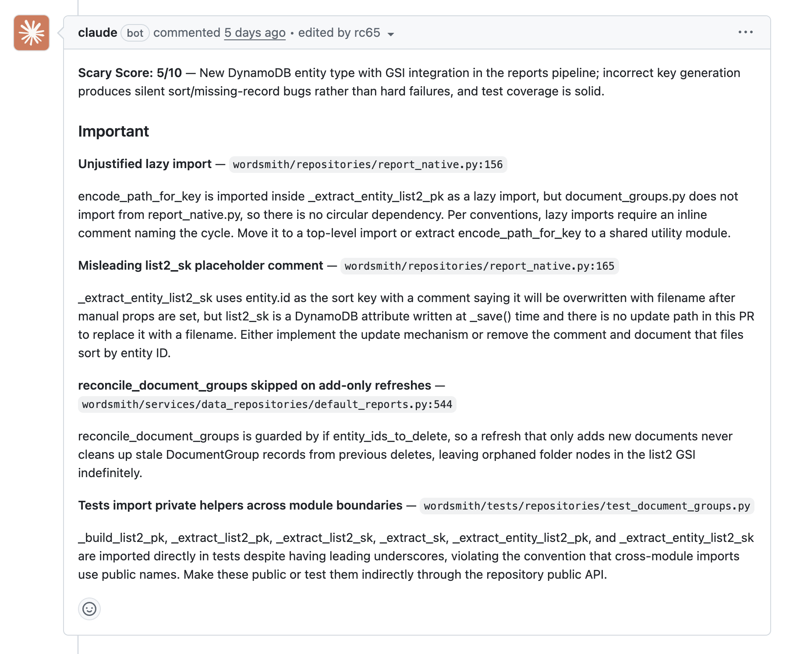

### The Problem

At Wordsmith, we've been building Claude Code into our development workflow for a while. We've been using it to write code, explore the codebase, debug production issues, etc. Naturally, we started using it for automated first pass code reviews as well. This helped to pick up language or framework specific issues, and possible bugs in logic, but it didn't have the full context of our codebase's conventions.

Our codebase, like many others over the last few years, has grown very quickly due to the acceleration in developer velocity afforded by AI tooling. This has been both a blessing and a curse; a blessing in that the time between envisaging and delivering a product feature has never been shorter, and a curse in that the proliferation of bad practices, anti-patterns, or just code that's not "how we like to do things" has never been more rapid. Without strong guidelines in place, AI will look to generate code that achieves its objective as quickly and easily as possible. To make matters worse, AI uses the existing codebase to inform its patterns and behaviour, so unchecked entropy becomes a cascading feedback loop.

We tried things like Copilot, just asking `@claude` for a review on Github, or using Anthropic's own `/pr-review-toolkit`. We found the last one the most useful — its specialized agents for things like silent failure detection and test coverage analysis were genuinely good — but it was missing our codebase-specific context.

We have specific patterns for how we like to handle things like optimistic concurrency. We have conventions for how API endpoints layer permissions. We have data structures we like to use to represent LLM questions and answers. We have specific things we like to avoid using in our front end code (I'm looking at you, `useEffect`). As AI coding assistants make it easier than ever to be a generalist, it's not reasonable to expect someone who mostly works on the backend code to know or remember the front end conventions we like to apply, and vice versa.

A React specialist reviewing a backend diff can easily miss auth permission decorators that are in the wrong order, or when someone uses a database access pattern that doesn't allow for a missing record when we should. Not because they're bad engineers, but because it's not a reasonable expectation that we can recall and apply every subtle rule we've agreed to implement in our codebase.

So we built a code review skill to do some of this work for us.

### The Skill

The skill is a structured, 7-step workflow that Claude runs whenever it reviews code:

1. Scope detection - it figures out what to review based on what you pass it: no args means current staged/unstaged changes, a PR number or URL means fetch the diff via `gh`, a branch name means diff against master.

2. Dynamic guideline loading — Based on which files changed, it loads the relevant guideline skills. Python files trigger `/guidelines-python`. Database or repository changes trigger `/guidelines-database`. Frontend changes load `/guidelines-frontend`, `/vercel-react-best-practices`, and `/web-design-guidelines`. This keeps the review focused and doesn't waste tokens loading Python conventions when you only touched a React component.

3. Code analysis — One review looking for two things: bugs and correctness issues (null handling, async problems, N+1 queries, security, dead code), and violations of the conventions loaded in the previous step.
   - **The Scary Score** — Every review gets a production risk score from 1 to 10. A typo fix is a 1. A new auth middleware is an 8. Schema migrations touching multi-tenant data are a 9 or 10. The score factors in blast radius, whether tests exist, how easy rollback is, whether the code path is concurrent or involves billing. In a world where most of our contributions are now written by AI, this helps human reviewers understand the level of scrutiny required for any given change. The hope is that we'll soon be able to automatically merge AI contributed PRs that have a scary score below a certain threshold. More on this to come in a future blog post.

   - **Test recommendations** — Based on the scary score and what changed, it tells you what to run. Frontend changes at score ≥5 get a recommendation to run the Playwright E2E suite. New inference or prompt changes get pointed at the LLM eval suite. New endpoints get flagged for pytest coverage. Not prescriptive — just "here's what you should probably verify before merging."

   - **Specialized agent dispatch** — Remember the `/pr-review-toolkit` from earlier? We didn't throw it away, we folded it in. The skill dispatches up to three of its sub-agents in parallel: `silent-failure-hunter` (catches swallowed exceptions and error-suppressing catch blocks), `pr-test-analyzer` (evaluates whether existing tests actually cover the new code paths, complementing the heuristic recommendations from the test recommendations step), and `type-design-analyzer` (only when the diff introduces new Pydantic models or TypeScript types). Their findings get mapped into the same format as the main review and merged before formatting.

4. Findings formatting — Raw findings from both the manual analysis and the dispatched agents go to a separate Task call using `claude-haiku-4-5` for filtering. One frustration we had with other tools was review could often be comprised of only nit-picks that were not worth addressing. With this filter step, if there's nothing important the review will just be `LGTM`.

5. PR comments — If a PR number was passed, findings are posted directly as a PR comment.

## The GitHub Action

Making this automatic was straightforward with [`anthropics/claude-code-action`](https://github.com/anthropics/claude-code-action). Here's the core of our workflow:

```yaml
on:
  pull_request:
    types: [opened]
  workflow_dispatch:
    inputs:
      pr_number:
        description: "PR number to review"
        required: true

jobs:
  code-review:
    runs-on: ubuntu-latest
    steps:
      - uses: anthropics/claude-code-action@v1
        with:
          model: claude-opus-4-6
          prompt: "/wordsmith-code-review PR #${{ inputs.pr_number || github.event.pull_request.number }}"
          allowed_tools: "Skill,Task,Read,Grep,Glob,Bash(git diff:*),Bash(git log:*),Bash(gh pr comment:*),Bash(gh pr diff:*)"
```

A few design choices worth noting:

Tool allowlist, not blocklist. We explicitly enumerate what the action can do. It can read files, run git commands, post PR comments. It cannot write files, run tests, push code, or do anything side-effectful beyond posting the review. This is a read-and-comment workflow, not an autonomous agent.

Restricted to `opened` events. We trigger on PR open, not every push. The goal is a first-pass review when the PR is fresh, not a review bot that fires on every commit. However, it can be triggered any number of times on a PR by commenting something like "`@claude`, please review again".

Same model as interactive Claude Code. We use `claude-opus-4-6` which is the same model engineers use interactively. We don't want a "GitHub Actions quality" review vs a "local quality" review. They should be identical.

The skill runs exactly the same code. This is the key thing. The GitHub Action doesn't have a separate "CI mode" or stripped-down prompt. It invokes `/wordsmith-code-review` the same way an engineer would at their terminal. The only difference is it has a PR number to post to.

## What Does a Review Actually Look Like?



A typical review surfaces a mix of:

- Critical bugs: missing null checks, wrong concurrency strategy for a repository mutator, a `find_one` where `find_maybe_one` is more appropriate
- Guideline violations: `Optional[str]` instead of `str | None`, a HeroUI `Button` import instead of `WsButton`, a router doing permission checks instead of delegating to the API layer
- Scary Score context: "This change touches multi-tenant session routing with no new tests. Score: 7. Recommend running the full session test suite before merging."

The formatter keeps output tight — no walls of text, no generic "consider adding error handling" suggestions. Each finding has a file path and line number, a severity (critical / important), and a concrete description.

## What We've Learned

Guidelines-as-code is the real investment. The skill itself is ~200 lines of orchestration markdown. The value comes from the guideline skills underneath it. But writing those guidelines had a secondary benefit we didn't anticipate: it forced us to articulate conventions that were previously implicit. Things that lived in "the way we do it" became concrete, reviewable documents. Human reviewers benefit from that clarity too, not just the AI.

The guidelines are also living documentation. When a reviewer spots a new pattern worth codifying during a PR review, they can comment something like "`@claude`, add a rule to our Python guidelines about always using `find_maybe_one` when a missing record is a valid case" and the guideline gets updated right there. The next review will apply it. The feedback loop between reviewing code and improving the review process is very short.

Composability makes it maintainable. The skill doesn't try to do everything itself. It dynamically loads guideline skills based on which files changed, dispatches pr-review-toolkit agents for specialized analysis, and delegates formatting to a separate model. Each piece is independently updatable. When we add a new convention, we edit one guideline file. When Anthropic improves the `silent-failure-hunter`, we get that for free. The skill is a thin orchestration layer over reusable building blocks, and that's what keeps it from becoming a monolith that nobody wants to touch.

Because the skill is just markdown, it runs identically in CI and on a dev machine. Engineers can run `/wordsmith-code-review` locally in their coding assistant and get the same project-specific review before they've even pushed. This shortens the feedback loop significantly — you don't have to open a PR to find out you used the wrong concurrency strategy.

## How to Do This Yourself

1. Write down your team's conventions as structured markdown files (we use `SKILL.md` in `.agents/skills/`)
2. Build a review skill that loads the right guidelines based on which files changed
3. Add a "Scary Score" calibrated to your codebase's risk topology
4. Wire it up with `anthropics/claude-code-action` in Github
5. Constrain the action's tool access to read-only + PR comment operations

The full skill is ~200 lines of markdown. The GitHub Action is ~40 lines of YAML. The value comes from the conventions underneath — the skill is just the delivery mechanism.
